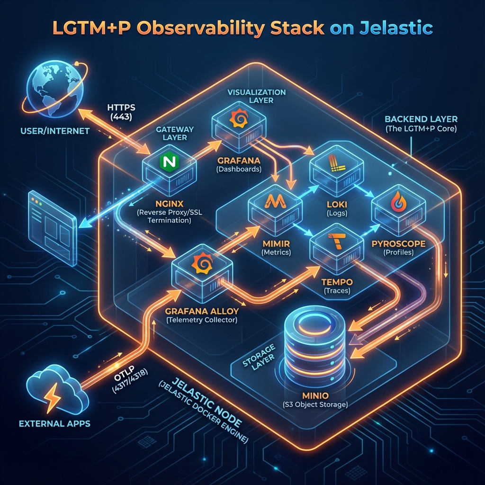

# 🔭 Sovereign Observability Stack (LGTM+P)

> **Simple to Start, Ready to Scale** — Production-ready Grafana observability stack on Jelastic PaaS

A complete observability platform featuring **Loki** (Logs), **Grafana** (Dashboards), **Tempo** (Traces), **Mimir** (Metrics), and **Pyroscope** (Profiles), with **MinIO** object storage and **Grafana Alloy** as the unified ingestion gateway.

## 🏗️ Architecture

```
┌─────────────────────────────────────────────────────────────────┐
│                     Customer Applications                        │
│                (OTLP → HTTPS → :443 / :80)                      │
└────────────────────────────┬────────────────────────────────────┘
                             │
┌────────────────────────────▼────────────────────────────────────┐
│                    TIER 4: SSL GATEWAY LAYER                     │
│  ┌──────────────────────────────────────────────────────────┐   │
│  │                        Nginx (SSL)                       │   │
│  │        • SSL Termination (Let's Encrypt)                 │   │
│  │        • Routing: /, /minio, /alloy, /v1/*               │   │
│  └────────────────────────────┬─────────────────────────────┘   │
└───────────────────────────────┼──────────────────────────────────┘
                             │
┌────────────────────────────▼────────────────────────────────────┐
│                    TIER 3: TELEMETRY LAYER                      │
│  ┌──────────────────────────────────────────────────────────┐   │
│  │                    Grafana Alloy                          │   │
│  │    • Unified OTLP Ingestion                              │   │
│  └──────────────────────────────────────────────────────────┘   │
└────────────────────────────┬────────────────────────────────────┘
                             │
┌────────────────────────────▼────────────────────────────────────┐
│                   TIER 2: BACKEND LAYER                          │
│  ┌─────────┐  ┌─────────┐  ┌─────────┐  ┌──────────┐           │
│  │  Mimir  │  │  Loki   │  │  Tempo  │  │ Pyroscope│           │
│  │ Metrics │  │  Logs   │  │ Traces  │  │ Profiles │           │
│  └────┬────┘  └────┬────┘  └────┬────┘  └────┬─────┘           │
│       └────────────┴────────────┴────────────┘                  │
│                            │                                     │
│  ┌─────────────────────────▼─────────────────────────────────┐  │
│  │                      Grafana UI                            │  │
│  │         (Unified dashboards with correlations)             │  │
│  └────────────────────────────────────────────────────────────┘  │
└────────────────────────────┬────────────────────────────────────┘
                             │
┌────────────────────────────▼────────────────────────────────────┐
│                   TIER 1: STORAGE LAYER                          │
│  ┌────────────────────────────────────────────────────────────┐  │
│  │                        MinIO                                │  │
│  │              S3-compatible Object Storage                   │  │
│  └────────────────────────────────────────────────────────────┘  │
└──────────────────────────────────────────────────────────────────┘
```


## 🚀 Quick Start

### Option 1: Jelastic One-Click Install

1. Go to your Jelastic Dashboard
2. Click **Import** → **URL**
3. Paste: `https://raw.githubusercontent.com/HameemDakheel/OTel-jps/main/manifest.jps`
4. Click **Install**
5. Save the credentials from the success popup
6. **Integration Guide**: See [INTEGRATION.md](INTEGRATION.md) for connecting your DB, LB, and apps.


### Option 2: Local Docker Compose

```bash
# Clone the repository
git clone https://github.com/HameemDakheel/OTel-jps.git
cd OTel-jps

# Copy and edit environment variables
cp .env.example .env
# Edit .env with your preferred passwords

# Start the stack
docker compose up -d

# Access Grafana at http://localhost:3000
```

## 📡 Connecting Your Applications

### Environment Variables

Configure your OpenTelemetry-instrumented application with:

```bash
# Replace <your-env-domain> with your Jelastic environment URL
export OTEL_EXPORTER_OTLP_ENDPOINT=https://<your-env-domain>/v1/
export OTEL_EXPORTER_OTLP_HEADERS="Authorization=Basic <base64_encoded_creds>"
export OTEL_SERVICE_NAME=my-application
export OTEL_RESOURCE_ATTRIBUTES=deployment.environment=production
```

### Jelastic Auto-Linker (Recommended)

Use the included add-on to automatically inject environment variables:

1. Go to your **Application Environment** in Jelastic
2. Click **Add-Ons** → **Import**
3. Paste: `https://raw.githubusercontent.com/YOUR-ORG/jelastic-observability/main/addons/linker.jps`
4. Enter your Observability environment name
5. Click **Install** — your app is now connected!

## 📁 Project Structure

```
.
├── .github/workflows/
│   └── deploy.yml              # CI/CD for auto-deployment
├── addons/
│   └── linker.jps              # App connection add-on
├── configs/
│   ├── alloy/
│   │   └── config.alloy        # Telemetry pipeline
│   ├── grafana/
│   │   ├── grafana.ini         # Grafana settings
│   │   └── provisioning/
│   │       └── datasources/
│   │           └── datasources.yml
│   ├── loki.yaml               # Logs backend
│   ├── mimir.yaml              # Metrics backend
│   ├── tempo.yaml              # Traces backend
│   └── pyroscope.yaml          # Profiling backend
├── scripts/
│   └── init_buckets.sh         # MinIO initialization
├── docker-compose.yml          # Service definitions
├── manifest.jps                # Jelastic installer
└── README.md
```

## 🔌 Service Ports

| Service | Port | Protocol | Purpose |
|---------|------|----------|---------|
| Grafana | 3000 | HTTP | Dashboard UI |
| Mimir | 9009 | HTTP | Prometheus-compatible API |
| Loki | 3100 | HTTP | Log queries & push |
| Tempo | 3200 | HTTP | Trace queries |
| Tempo | 4317 | gRPC | OTLP traces (direct) |
| Tempo | 4318 | HTTP | OTLP traces (direct) |
| Pyroscope | 4040 | HTTP | Profiling API |
| MinIO | 9000 | HTTP | S3 API |
| MinIO | 9001 | HTTP | Console UI |
| Alloy | 12345 | HTTP | Pipeline UI |
| Alloy | 4319 | gRPC | OTLP ingestion (via Alloy) |
| Alloy | 4320 | HTTP | OTLP ingestion (via Alloy) |

## 📈 Scaling Guide

| Stage | Trigger | Action |
|-------|---------|--------|
| **Vertical** | CPU > 80% or OOM | Increase cloudlets in Jelastic dashboard |
| **Storage** | Disk full | Add larger volumes or migrate MinIO to dedicated cluster |
| **Horizontal Ingestion** | Alloy dropping packets | Add Alloy replicas behind load balancer |
| **Distributed** | Query slowness > 10s | Split to microservices mode |

## 🔧 Configuration

### Retention Settings

Edit the respective config files to adjust retention:

- **Metrics (Mimir)**: `configs/mimir.yaml` → `compactor_blocks_retention_period`
- **Logs (Loki)**: `configs/loki.yaml` → `retention_period`
- **Traces (Tempo)**: `configs/tempo.yaml` → `block_retention`

Default: **31 days (744h)**

### Multi-Tenancy

To enable multi-tenancy, set in each config:

```yaml
multitenancy_enabled: true
# or
auth_enabled: true
```

Then configure Alloy to inject `X-Scope-OrgID` headers.

## 🔐 Security Notes

1. **Change default passwords** in your JPS installation settings.
2. **Restrict firewall rules** to only allow your application IPs (optional, but recommended).
3. **Basic Authentication** is enforced by default on ALL ingestion and admin endpoints.
4. **All traffic** is secured via HTTPS/TLS.

## 🐛 Troubleshooting

### Check Service Health

```bash
# Via docker compose
docker compose ps
docker compose logs <service-name>

# Health endpoints
curl http://localhost:3000/api/health    # Grafana
curl http://localhost:9009/ready         # Mimir
curl http://localhost:3100/ready         # Loki
curl http://localhost:3200/ready         # Tempo
```

### Common Issues

| Issue | Cause | Solution |
|-------|-------|----------|
| Services crashing | Buckets not created | Wait for `minio-init` to complete |
| No data in Grafana | Wrong OTLP endpoint | Check firewall and port mappings |
| Ingestion errors | Bucket access denied | Verify MinIO credentials match |

## 📚 Documentation

- [Grafana Documentation](https://grafana.com/docs/)
- [Mimir Docs](https://grafana.com/docs/mimir/latest/)
- [Loki Docs](https://grafana.com/docs/loki/latest/)
- [Tempo Docs](https://grafana.com/docs/tempo/latest/)
- [Pyroscope Docs](https://grafana.com/docs/pyroscope/latest/)
- [Alloy Docs](https://grafana.com/docs/alloy/latest/)
- [Jelastic JPS Reference](https://docs.cloudscripting.com/)

## 📄 License

MIT License — See [LICENSE](LICENSE) for details.
